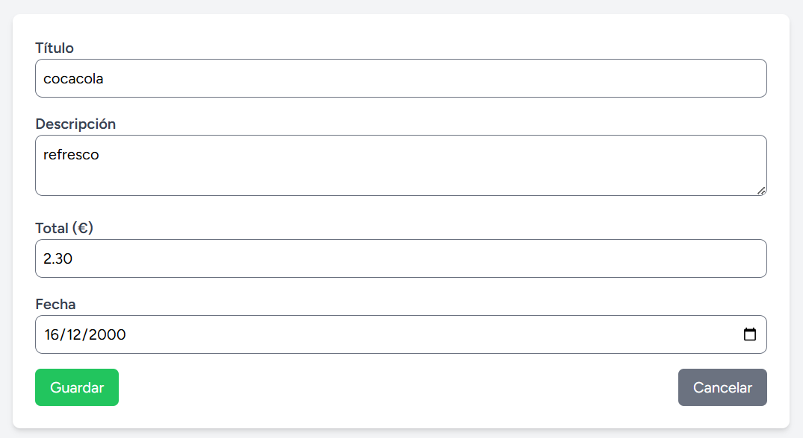

# Proyecto de Gestión de Gastos

Este proyecto es una aplicación web para gestionar productos/gastos, donde se pueden crear, editar y eliminar tickets. A continuación, se explica cómo iniciar y utilizar el proyecto.

---

## Contenido

- [Requisitos Previos](#requisitos-previos)
- [Iniciación del Proyecto](#iniciación-del-proyecto)
- [Uso de la Aplicación](#uso-de-la-aplicación)
  - [Acceso y Autenticación](#acceso-y-autenticación)
  - [Gestión de Gastos](#gestión-de-gastos)
- [Validaciones y Reglas](#validaciones-y-reglas)
- [Capturas de Pantalla](#capturas-de-pantalla)
- [Notas Finales](#notas-finales)

---

## Requisitos Previos

- [Docker](https://www.docker.com/) instalado en tu sistema.
- [Node.js](https://nodejs.org/) y [npm](https://www.npmjs.com/) para compilar los assets.
- Acceso a la terminal de comandos.

---

## Iniciación del Proyecto

Para levantar el entorno y migrar la base de datos, sigue estos pasos en orden:

1. **Levantar contenedores con Sail:**  
   Ejecuta el siguiente comando para iniciar los contenedores en modo desacoplado:
   ```bash
   ./vendor/bin/sail up -d
   ```
   Nota: Este comando permite utilizar la consola de comandos del contenedor. Si lo prefieres, puedes abrir otra terminal para trabajar en paralelo.

2. **Ejecutar migraciones:**  
   Una vez los contenedores estén corriendo, migra la base de datos:
   ```bash
   ./vendor/bin/sail artisan migrate
   ```

3. **Compilar los assets:**  
   Finalmente, ejecuta el siguiente comando para compilar los assets de la aplicación:
   ```bash
   npm run dev
   ```

4. **Acceso a la aplicación:**  
   Cuando ejecutes `npm run dev`, se te mostrarán varias URLs. Selecciona la que corresponde a localhost.


---

## Uso de la Aplicación

### Acceso y Autenticación

Una vez que ingresas a la aplicación en tu navegador, notarás en la parte superior de la pantalla dos opciones: Login y Register. Para realizar pruebas, utiliza el siguiente usuario:

- **Usuario:** usuario_test@gmail.com
- **Contraseña:** 12345678


### Gestión de Gastos

#### Acceso a la sección de gastos:

Dentro de la aplicación, haz clic en el botón o enlace Gastos para visualizar la tabla de tickets.


#### Crear un nuevo producto/ticket:

Haz clic en el botón azul grande para agregar un nuevo ticket. Al crear un ticket, asegúrate de que los campos obligatorios se completen según las siguientes reglas:

- Nombre
- Descripción
- Precio
- Mes

Además, la fecha asociada al ticket no puede estar en el futuro.



#### Editar o eliminar un ticket:

Una vez creado el ticket, tendrás opciones para editar o eliminarlo, puede editartlo con el boton "naranja" que pone editar y eliminarlo con el boton rojo que poner "eliminar"


---

## Validaciones y Reglas

- **Campos Obligatorios:** Los campos de nombre, descripción, precio y mes deben ser completados obligatoriamente.
- **Validación de Fecha:** La fecha no puede ser una fecha futura.
- **Acciones Disponibles:** Cada ticket puede ser editado o eliminado según sea necesario.

---

## Notas Finales

Recuerda que para realizar cambios en el código o en la base de datos, es posible que necesites reiniciar los contenedores o ejecutar comandos de migración adicionales. Asegúrate de tener todas las dependencias instaladas correctamente para evitar errores durante la ejecución.

¡Gracias por revisar el proyecto!